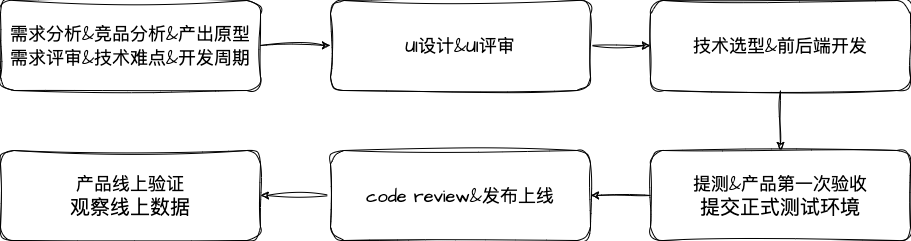
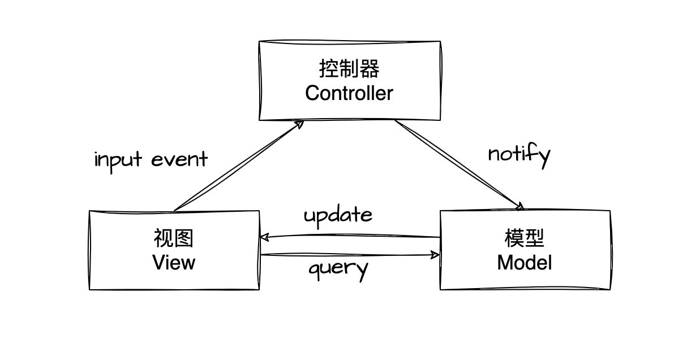
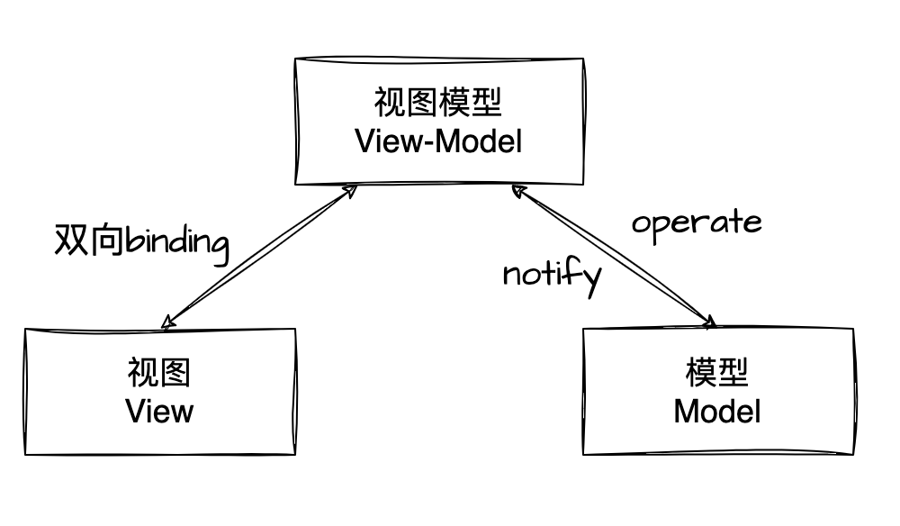
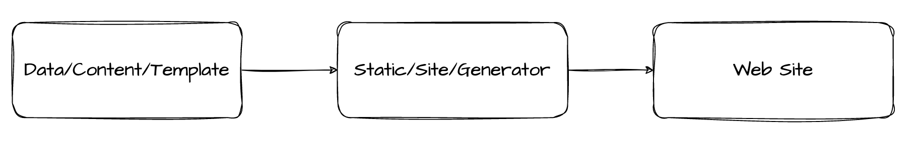
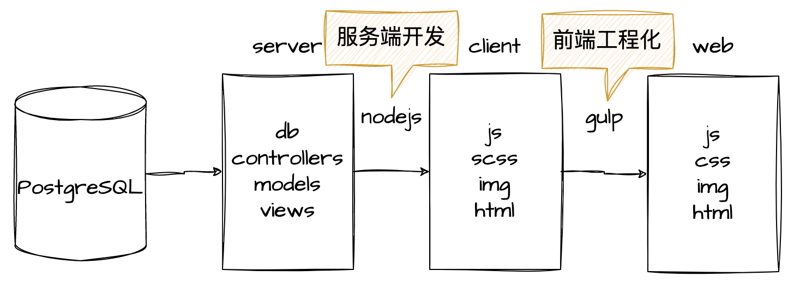
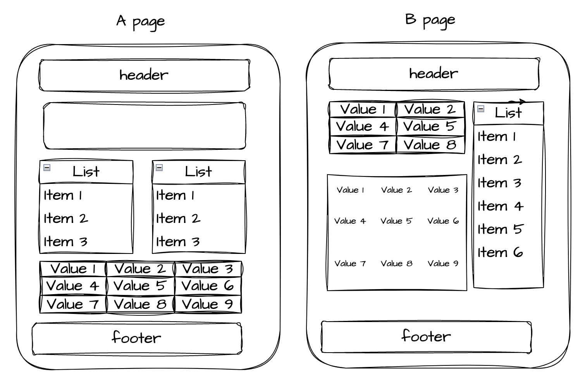

# 前端开发分享

## 项目开发流程



## 前端开发

### 1. 需求分析

> 明确项目目的和范围，理解实际需求场景，理解接口和后端数据设计，形成技术需求文档；

---

- 需求背景和目标：了解需求提出的背景和目标，清楚了解需求的目的和意义。
- 需求描述和功能点：仔细阅读需求文档，确认需求描述是否完整、准确、清晰，并理解需求中的功能点。
- 业务流程和用例：了解需求所涉及的业务流程和用例，确保前端设计和开发能够满足业务流程和用例的要求。
- 技术实现方案：了解需求中的技术实现方案，确认技术实现方案是否可行，是否符合前端开发的技术能力。
- 风险评估和解决方案：评估需求中的风险，制定解决方案，确保在开发过程中能够及时解决风险问题。
- 时间和资源评估：评估前端开发所需的时间和资源，并制定合理的计划，确保前端开发能够按时完成。

### 2. 技术选型

> 在设计阶段需要根据项目需求选择适合的技术方案和架构，比如使用什么技术栈、框架、库和前端构建工具等。需要考虑技术的成熟度、稳定性、可维护性和团队的情况等因素。

#### 架构模式

**1. MVC （Model View Controller）**

> `MVC` 模式将程序分为三个部分：模型（`Model`）、视图（`View`）、控制器（`Controller`）。

- `Model` 模型层： 业务数据的处理和存储，数据更新后更新；
- `View` 视图层： 人机交互接口，一般为展示给用户的界面；
- `Controller` 控制器层 ： 负责连接 `Model` 层和 `View` 层，接受并处理 `View` 层触发的事件，并在 `Model` 层的数据状态变动时更新 `View` 层；



**2. MVVM （Model View ViewModel）**

> `MVVM` 模式将程序分为三个部分：模型（`Model`）、视图（`View`）、视图模型（`View-Model`）。
>
> `MVVM` 模式的特征是 `ViewModel` 层和 `View` 层采用双向绑定的形式（Binding），`View` 层的变动，将自动反映在 `ViewModel` 层



#### 渲染模式

##### CSR(Client Side Rendering)

客户端渲染,**前后端分离**，通过RESTful协议进行开发，指将所有页面加载和渲染操作都发生在客户端(浏览器)。只加载必要的 JS 脚本和 CSS 样式到客户端,而将页面模板和数据在客户端生成 HTML,通过 JS 动态渲染到页面中。典型的 CSR 框架有 Vue、React 和 Angular 等。


优点:

- 快速响应，无刷新
- 良好的开发体验(HMR)
- 低延迟(不需要等待服务端渲染)

缺点:

- 不利于 SEO
- 首屏加载慢

##### SSR(Server Side Rendering)

服务端渲染,指将组件在服务端渲染为完整的 HTML 页面,同时注入必要的 JS 脚本,然后直接发送到客户端。用户第一次访问时服务端会返回完整渲染好的页面,随后客户端 JS 会接管并将交互操作渲染到页面上。典型的 SSR 框架Vue的Nuxt.js、React的Next.js等,实现同构。


优点:

- 有利于 SEO
- 首屏加载快

缺点:

- 复杂,需要维护服务端渲染
- 服务端压力较大
- 客户端无初始 HTML,无法通过分析原 HTML 进行预加载等优化

##### SSG(Static Site Generation)

静态站点生成,是一种创建静态网站的方法，指在构建时将动态页面预生成为 HTML 文件。和 SSR 的区别在于 SSG 会在构建时生成所有可能的routes,而 SSR 每次请求都会渲染内容。SSG 可以更好的支持 SEO,并减轻服务端的压力。常见的 SSG 框架有 Nuxt.js、Next.js 和 Gatsby 等。



优点:

- 优秀的 SEO 支持
- 轻量的服务端，更快的加载速度
- 客户端有完整 HTML,可以进行各种预加载、预渲染优化

缺点:

- 仅支持预生成的路由
- 无法实现真实的动态路由
- 生成大量的页面耗时

#### 结合业务模式

##### ==架构模式选择MVC && 渲染模式SSG==



### 3. 组件模块划分

> 根据实际功能，考虑不同页面重用程度，合理划分项目组件，包括布局组件、业务组件、公共组件等

在前端分析页面，抽离公共组件和模板通常需要以下步骤：

1. 找到重复出现的 UI 元素和布局结构。这些元素和结构可能包含头部、底部、导航栏、侧边栏、卡片等等。
2. 把这些重复出现的元素和结构抽象成公共组件。例如，可以把导航栏抽象成一个 Navbar 组件，底部抽象成一个 Footer 组件等等。
3. 把公共组件独立成可重用的模块。这些模块可以单独打包，然后在需要使用它们的页面中引入。
4. 把页面中的相同布局结构抽象成公共模板。例如，可以把包含头部、底部和导航栏的布局结构抽象成一个 Layout 模板，然后在需要使用它的页面中引入。
5. 在页面中使用公共组件和公共模板。这样可以减少代码冗余，提高代码可维护性和可读性。
6. 减少代码冗余：公共组件和模板可以在多个页面中复用，避免重复编写相同的代码。
7. 提高代码可维护性和可读性：公共组件和模板可以使代码结构更加清晰，便于维护和阅读。
8. 提高开发效率：使用公共组件和模板可以加快开发速度，减少开发时间。



### 4. 代码质量管理

> 使用代码质量管理工具，如Lint、ESLint等，保证代码规范和质量，减少潜在的bug和问题。

1. 代码规范性：使用一致的代码风格和命名规范，可以增加代码可读性和可维护性。在 JavaScript 项目中，可以使用 ESLint 等工具来自动检查代码风格和语法错误。
2. 文档化：编写文档可以帮助其他开发人员理解代码的作用和实现方式。在代码中添加注释和文档是一个好习惯。
3. 代码重构：重构是指修改代码结构、优化代码性能、简化代码等行为。通过重构代码，可以使代码更易于维护和扩展。
4. 团队合作：团队成员应该共同遵守代码规范和最佳实践。同时，应该使用代码审查、版本控制等工具来监控代码的质量和进度。
5. 自动化部署：使用自动化部署工具可以确保每次代码更新都能快速、准确地部署到生产环境中。自动化部署可以使用 Jenkins、Travis CI 等工具。

### 5. 响应式设计

> 前端响应式设计是一种能够使网站或应用程序在不同设备上（如桌面电脑、平板电脑、手机）自适应布局的设计方式。

1. 使用弹性布局（Flexbox）或网格布局（Grid Layout：流式布局能够随着浏览器窗口大小的变化而自适应变化，是实现响应式适配的关键。同时，通过媒体查询等技术，可以根据不同的设备屏幕尺寸和分辨率，选择不同的流式布局。
2. 使用弹性图片和视频：在响应式适配中，图片和视频的大小也需要根据设备屏幕的尺寸和分辨率自适应调整。可以使用弹性图片和视频来实现这一点，比如使用 max-width: 100% 和 height: auto 等属性。
3. 优化字体和排版：在不同的设备上，字体和排版的大小和间距也需要根据设备屏幕尺寸和分辨率自适应调整。可以使用 rem 和 em 等单位，根据父元素的大小来定义字体和排版的大小。
4. 设计响应式导航菜单：在小屏幕设备上，导航菜单可能需要以侧边栏或折叠菜单的形式呈现，而不是在大屏幕设备上的常规导航栏。可以使用 JavaScript 和 CSS 来实现响应式导航菜单。
5. 使用媒体查询和断点：媒体查询和断点是响应式适配的关键，可以根据不同的设备屏幕尺寸和分辨率，选择不同的样式和布局。可以使用 CSS 的 @media 规则来实现媒体查询和断点。
6. 测试和调试：响应式适配需要在多种设备和浏览器上进行测试和调试。可以使用模拟器、真实设备和浏览器开发工具来测试和调试响应式适配。

##### Bootstrap5 的分类

| xs     | sm     | md     | lg     | xl      | Xxl     |
| ------ | ------ | ------ | ------ | ------- | ------- |
| <576px | ≥576px | ≥768px | ≥992px | ≥1200px | ≥1400px |

xxl的1400px对应的是MacBook Air 2017 1440*900分辨率显示器。看起来太小了一点，但也许Bootstrap认为更宽的屏幕已经没有意义，用户量少且体验不佳。毕竟需要转头才能浏览的宽屏，是没有必要专门去适配的。

```css
/* 应用于极小屏幕，如移动设备竖屏状态下 */
@media (max-width: 575.98px) {
  /* 在此处添加适合极小屏幕的CSS样式 */
}

/* 应用于小屏幕，如移动设备横屏状态下或平板电脑 */
@media (min-width: 576px) and (max-width: 767.98px) {
  /* 在此处添加适合小屏幕的CSS样式 */
}

/* 应用于平板电脑屏幕，如竖屏状态下 */
@media (min-width: 768px) and (max-width: 991.98px) {
  /* 在此处添加适合平板电脑屏幕的CSS样式 */
}

/* 应用于中等屏幕，如笔记本电脑 */
@media (min-width: 992px) and (max-width: 1199.98px) {
  /* 在此处添加适合中等屏幕的CSS样式 */
}

/* 应用于大屏幕，如较大的显示器或电视屏幕 */
@media (min-width: 1200px) and (max-width: 1399.98px) {
  /* 在此处添加适合大屏幕的CSS样式 */
}

/* 应用于极大屏幕，如超大的显示器或电视屏幕 */
@media (min-width: 1400px) {
  /* 在此处添加适合极大屏幕的CSS样式 */
}
```

### 6. 性能优化

> 对网站性能进行优化，包括减少HTTP请求、使用缓存、代码压缩、图片优化、懒加载、资源合并等，提高网站的加载速度和用户体验。

1. 减少HTTP请求次数：通过减少页面上的资源文件（例如，脚本、样式表、图像等）的数量来缩短加载时间。
2. 使用缓存：通过使用浏览器缓存来减少服务器的负载和减少页面加载时间。
3. 压缩文件：通过压缩文件来减少文件大小，从而减少下载时间。
4. 使用CDN：通过使用内容分发网络（CDN）来缩短加载时间，并减轻服务器负担。
5. 延迟加载：通过延迟加载非关键资源，例如图像、脚本和样式表，来加快页面加载时间。
6. 压缩图像：通过压缩图像来减少文件大小，从而减少下载时间。
7. 使用合适的图片格式：使用合适的图像格式，例如JPEG、PNG或WebP，以优化图像加载速度。
8. 减少DOM操作：DOM操作是消耗性能的，尽可能减少DOM操作。
9. 代码优化：使用优化的代码，例如去除注释和空格，并避免使用长时间运行的JavaScript代码。
10. 减少重绘和重排：通过尽可能减少DOM元素的变化来避免重绘和重排。

### 7. SEO优化

> 对网站进行SEO（搜索引擎优化）处理，包括关键词优化、页面结构优化、内链外链等，提高网站在搜索引擎中的排名和曝光度。

1. 合理的页面结构：使用语义化的HTML标签，将页面内容分成不同的模块，并使用合适的标题和段落来组织内容。
2. 关键词优化：将关键词适当地插入页面标题、描述、内容和链接等位置，并使用H1标签包含主要关键词。
3. 图片优化：给图片添加ALT属性描述，使用小而有意义的文件名和描述性的标题，以便搜索引擎能够识别和索引图片。
4. 内容质量优化：提供高质量的内容，定期更新和发布有用的文章和信息，增加用户停留时间。
5. 网站速度优化：减少页面加载时间，压缩代码、图片和CSS等资源，提高用户体验和搜索引擎的评分。
6. 适应性设计：确保网站在不同设备和屏幕尺寸下的显示效果良好，并使用响应式设计和meta标签进行适配。
7. 网站安全性：使用HTTPS协议和SSL证书加密传输数据，增加搜索引擎的信任度和评分。

### 8. 测试和调试

> 进行测试和调试，包括单元测试、集成测试、功能测试等，保证代码的质量和可靠性

1. 自测：根据需求文档进行测试，有没有漏掉功能和开发功能和需求不匹配。
2. 调试工具：调试工具用于帮助开发人员识别和解决前端代码中的问题。常见的调试工具包括Chrome开发者工具。
3. 调试技巧：例如使用console.log()、debugger语句和源代码映射等技巧可帮助开发人员调试前端代码中的问题。
4. 集成测试：集成测试是一种测试方法，可用于测试整个应用程序的功能和性能。这有助于确保应用程序的各个部分协同工作。
5. UI测试：UI测试是一种测试方法，可用于测试应用程序的用户界面。这有助于确保应用程序的用户友好性和易用性。
6. 浏览器兼容性测试：由于不同的浏览器对前端代码的解释方式不同，因此浏览器兼容性测试可用于确保应用程序在不同浏览器中的表现一致。

### 9. 持续集成

> 前端持续集成和持续交付（CICD）是指在开发、测试和部署前端应用程序时，采用自动化工具链的过程

1. 代码托管：将前端代码托管到 Git 仓库中，如 GitHub、GitLab 或 **Bitbucket**。
2. 自动化构建：使用自动化构建工具，如 Jenkins、Travis CI、Circle CI 或 GitLab CI 等，将前端代码构建成可部署的代码。
3. 自动化测试：在构建过程中自动运行测试，确保前端应用程序满足质量标准，例如代码规范、功能测试、性能测试、安全性测试等。
4. 自动化部署：将构建好的前端代码部署到测试环境或生产环境中。可以使用自动化工具，如 Jenkins、 Docker 等。
5. 自动化监控：监控部署后的前端应用程序，确保其在生产环境中正常运行。日志监控工具或错误监控工具等。
6. **持续交付**：在所有测试通过后，将前端代码自动地部署到生产环境中，以实现持续交付的目标。

### 10. 用户行为分析

> 通过用户行为分析工具，如Google Analytics(GA)等，了解用户的使用行为和偏好，优化网站的设计和功能。

##### 埋点

1. PV(页面访问量)，UV(独立访客数)，点击量（Clicks）...

2. 确定需要追踪的事件。在设计前端用户行为埋点时，首先需要确定需要追踪的事件，例如页面浏览、按钮点击、表单提交等。

3. 编写事件追踪代码。一旦确定了需要追踪的事件，开发人员可以编写相应的事件追踪代码。

通过在前端应用程序中添加用户行为埋点，开发人员可以收集并分析用户在应用程序中的行为数据，以便优化用户体验和提高应用程序的性能；


